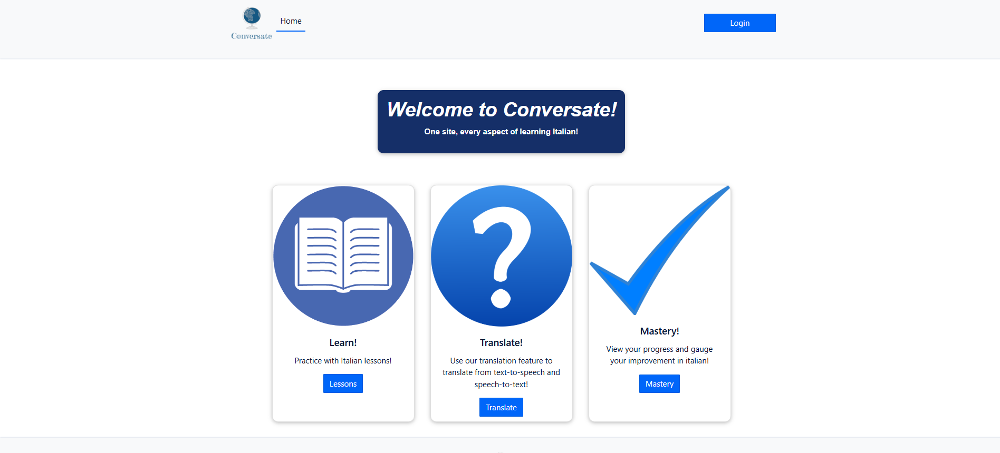

# Conversate - 2020

  
  
  

Conversate is a full-stack web application for learning basic Italian. 

[Visit modernized version of Conversate here.](https://github.com/ryanhillman/conversate)

It was originally designed as a capstone group project.

Thank you to everyone involved.

---

## Tech Stack

- **Backend:** Python 3.7, Flask, SQLAlchemy, PostgreSQL, Alembic, Gunicorn

- **Frontend:** Vue 2, Vue Router, Axios, Sass

- **Authentication:** Auth0

---

## Screenshot

